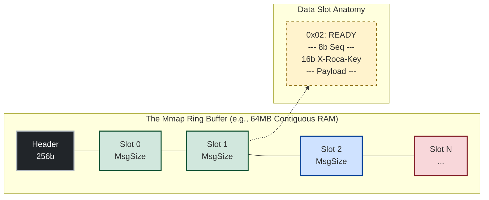
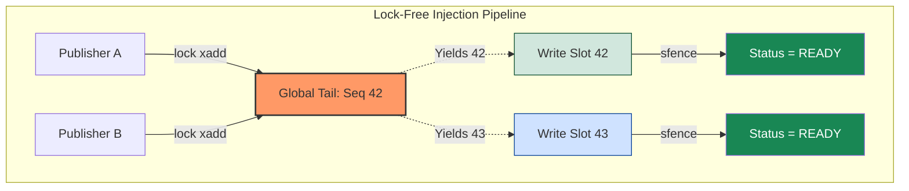

# Architecture of La Roca Micro-PubSub: The Zero-Abstraction Broker

La Roca Micro-PubSub is an exercise in uncompromising efficiency and mechanical sympathy. In an ecosystem dominated by heavy JVM message brokers, Garbage Collection pauses, and bloated distributed consensus protocols, this document explores the low-level mechanics—from `lock xadd` atomics to $O(1)$ memory mapping—that allow a sub-10KB x86_64 Assembly engine to route, batch, and stream over **2,750,000 Messages Per Second** with zero dynamic allocations.

---

## 1. The Geometry of Memory: O(1) Ring Buffers & Disk Authority

Traditional brokers parse files and maintain complex indexing trees in the heap to locate messages. **La Roca** discards the heap entirely. It relies on **Deterministic Byte Geometry** and OS-level memory-mapped files (`mmap`), transforming file I/O into instantaneous RAM pointer arithmetic.

### 1.1 The Hardware-Aligned Slot

Dynamic memory allocation is the enemy of deterministic latency. Topics in La Roca are pre-allocated contiguous memory blocks mapped directly to NVMe storage. Every message lives inside a mathematically rigid slot.

* **Zero Parsing Overhead:** No JSON metadata, no variable-length framing on the read path.
* **The Structural Contract:** `[Status (1B)] [Sequence (8B)] [Routing Key (KB)] [Payload (NB)]`
* **SIMD Key Alignment:** The Routing Key (`X-Roca-Key`) defaults to 16 bytes. This is not arbitrary; it ensures 128-bit SIMD alignment, allowing the hardware to extract or filter stream topologies in a single CPU clock cycle without cache boundary penalties.



### 1.2 The $O(1)$ Addressing Formula

Because messages are fixed-size, the subscriber engine never parses or scans the file. It resolves the exact physical memory address for any sequence in pure $O(1)$ time using modulo arithmetic. This mathematical certainty is why consuming message sequence `5,000,000` takes the exact same number of nanoseconds as reading sequence `1`.

$$Address(sequence) = BaseAddress + 256 + ((sequence \pmod{MaxMessages}) \times MessageSize)$$

### 1.3 Disk Authority & Immutability

To protect this $O(1)$ geometry from deployment misconfigurations (e.g., poisoned environment variables during a Kubernetes pod restart), La Roca enforces **Disk Authority**. The engine tattoos the exact `MsgSize`, `MaxMsgs`, and `KeySize` into the first 24 bytes of the binary file header. Upon boot, the C/ASM boundaries read the disk first, guaranteeing offset math remains permanently pristine.

---

## 2. Lock-Free Concurrency & Hardware Routing

### 2.1 The `lock xadd` Atomic Engine

High-throughput systems are usually bottlenecked by OS-level Mutexes or Semaphores when multiple threads or processes attempt to publish simultaneously. La Roca operates entirely lock-free.

* **Hardware Arbitration:** Instead of putting processes to sleep, La Roca delegates concurrency control directly to the CPU's memory controller using the `lock xadd` instruction.
* **Zero-Wait Injection:** Multiple publishers hit the `mmap` header simultaneously. The CPU atomic guarantees that each publisher receives a unique, monotonically increasing Sequence ID in a fraction of a nanosecond, instantly reserving their exclusive memory slot.
* **Memory Barriers:** To prevent modern out-of-order execution CPUs from reordering memory writes, the engine utilizes `sfence` (Store Fence) after writing the payload, ensuring the `READY` status byte is only visible to subscribers once the payload is fully committed to RAM.



### 2.2 The $O(\log N)$ Topic Resolution

Dynamic topic routing typically implies heavy hash maps. La Roca uses an L1-cache aligned, contiguous array of 24-byte entries (16 bytes for the name, 8 bytes for the mmap pointer). Topics are kept strictly alphabetized via right-shifting memory blocks during auto-provisioning. This allows the router to locate any topic in memory via **Binary Search**, keeping pointer chasing strictly within the processor's fastest cache.

---

## 3. The Syscall Router: Life without Libc

Most modern brokers are shackled to the heavy abstractions of the C Standard Library (`libc`) or bulky language runtimes. **La Roca** severs this dependency. By executing raw `syscall` instructions directly against the Linux kernel, we achieve a statically pure, "Zero-Libc" architecture.

### 3.1 Strict L7 Routing & Endianness Bitmasking

Parsing HTTP headers string-by-string is slow. La Roca's router (`route_api.asm`) leverages 64-bit register bitmasking and Little-Endian comparative math to route Layer 7 traffic in a single CPU cycle.

* Instead of comparing strings, it loads the first 4 bytes of the socket buffer into the `EAX` register and compares them as a raw hexadecimal integer: `cmp eax, 0x20544547` (which translates perfectly to `"GET "`).
* Illegal verbs (e.g., `DELETE`, `PUT`) instantly trigger an elegant HTTP `400 Bad Request` fallback, dropping the payload while preserving HTTP/1.1 keep-alive compliance without allocating error objects.

### 3.2 The Hot Loop (Batching & MPUB)

To bypass the physical limits of the TCP loopback interface, La Roca introduces batched endpoints (`/mpub` and `/batch`).
When ingesting a multi-publish payload separated by `\n`, the engine establishes an Assembly "Hot Loop". It scans the raw socket buffer byte-by-byte in register memory, surgically calculating payload lengths, and pushing them sequentially into the Ring Buffer while preserving loop counters in the hardware stack (`push rcx`, `push r8`). This reduces network syscalls by 99%.

```mermaid
graph LR
    subgraph "Zero-Libc Network Stack"
        Kernel[Linux Kernel<br/>Epoll TCP Stream] -.->|sys_read| Buffer[Pre-Allocated RAM]
        Buffer -->|Little-Endian Mask| Router{O(1) HTTP Router}
        Router -->|Illegal Verb| Drop[HTTP 400 Fallback]
        
        Router -->|POST /mpub| MPUB[Hot Loop Ingestion]
        MPUB -->|Extract X-Roca-Key| Ring[Ring Buffer mmap]
    end
    
    style Drop fill:#f8d7da,stroke:#842029,stroke-width:2px
    style Ring fill:#d1e7dd,stroke:#0f5132,stroke-width:2px
    style Kernel fill:#cfe2ff,stroke:#084298
```

---

## 4. Engineering with an "Alien" Junior (The AI Methodology)

Building a production-ready HTTP Router and Lock-Free Ring Buffer in pure x86_64 Assembly in 2026 is often dismissed as a "lost art." **La Roca** resurrected this discipline through a symbiotic methodology: pairing a Senior Systems Architect with a high-reasoning AI agent. The AI was treated strictly as an "Alien Junior"—a high-speed instruction synthesizer operating under uncompromising architectural constraints.

### 4.1 System V ABI Strictness & Stack Shields

To eliminate the "algorithmic drift" common in LLM-generated code, we enforced rigid register topology. However, Assembly is unforgiving. During the v1.3.0 Stream Processing upgrade, a critical System V AMD64 ABI violation occurred: the 5th parameter (`r8` - Dest Key Buffer) clobbered the `mmap` base pointer.

This was solved through strict **Tactical Stack Shielding**, re-pinning base pointers to non-volatile registers (`r12`) and manually auditing every `push`/`pop` balance to ensure the execution state survived nested subroutine jumps.

### 4.2 Security Hardening & Fuzzing

In the absence of a high-level compiler’s safety nets, we relied on a brutal **Test-Driven Assembly** workflow to catch memory violations before they reached the disk.

* **Header Overflows:** Giant routing keys (e.g., 1000 bytes) are instantly intercepted and safely truncated to `ROCK_KEY_SIZE` via the `cmovg` instruction, preventing buffer overflows into adjacent slots.
* **Delimiter Flooding:** The `/mpub` endpoint is shielded against "Empty Message Bombs" (consecutive `\n` flooding) via hardware-level zero-length guards (`test r8, r8 / jz .skip`), ensuring the Ring Buffer sequences are never wasted by malicious or malformed payloads.

---

## 5. Future Horizons: The BlockMaker Roadmap

La Roca is designed to be the circulatory system of a high-performance microservices architecture. Our roadmap focuses on expanding hardware-level capabilities while maintaining our strictly minimal footprint:

* **⚡ JIT Stream Processor:** Integrating eBPF/Wasm runtimes directly into the mmap consumer path for on-the-fly payload transformations.
* **📡 io_uring Migration:** Transitioning from standard synchronous syscalls (`epoll`) to Linux `io_uring` for true asynchronous, zero-copy I/O.
* **🌍 Aarch64 Porting:** Bringing La Roca’s sub-10KB efficiency to ARM64 architectures, targeting high-density AWS Graviton instances.

---

## 🛡️ Engineered by BlockMaker

**La Roca Micro-PubSub** is a statement against software bloat and a return to deterministic, instruction-level engineering.

* **Design & Architecture:** Fernando Ezequiel Mancuso
* **Organization:** [BlockmakerCompany](https://github.com/BlockmakerCompany)
* **Release:** March 2026 | v1.3.0
* **Inquiries:** For industrial integration or low-level consulting, reach out via [GitHub Issues](https://github.com/BlockmakerCompany/la-roca-pubsub/issues).

> *"The best way to understand how a computer works is to stop asking the operating system for permission and start giving it orders."*
> — **The BlockMaker Manifesto**

---

## 🛡️ Lead Architect

**Fernando Ezequiel Mancuso**
*Systems Architect & Low-Level Specialist*
[LinkedIn Profile](https://www.linkedin.com/in/fernando-ezequiel-mancuso-54a2737/)

> "The distance between the metal and the code is where true efficiency lives."
> — **BlockMaker Philosophy**